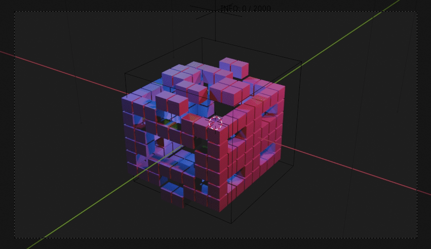

# Клеточные автоматы в Blender

### Описание:

Проект представляет собой набор скриптов на языке Python для запуска в [Blender](https://www.blender.org/) и предназначен для реализации трехмерных клеточных автоматов с различными правилами.

Основная идея проекта заключается в возможности комбинирования трехмерных [клеточных автоматов](https://ru.wikipedia.org/wiki/%D0%9A%D0%BB%D0%B5%D1%82%D0%BE%D1%87%D0%BD%D1%8B%D0%B9_%D0%B0%D0%B2%D1%82%D0%BE%D0%BC%D0%B0%D1%82) с различными правилами в одном пространстве. Для этого предусмотрена возможность разметки областей с такими правилами с помощью примитивных объектов, которые после создания преобразуются в **трехмерные матрицы**. Эти матрицы динамически пересчитывают свои значения при изменении первичного объекта.

Для удобства работы с матрицами реализованы различные функции. Вы можете сочетать и агрегировать матрицы, используя функции для объединения, вычитания и получения полого объекта.

Буду рад, если этот проект поможет вам создавать уникальные трехмерные клеточные автоматы в Blender и откроет новые возможности для вашего творчества.

***

### Функционал проекта:

- [tensor.py](tensor.py) - модуль для работы с трехмерными матрицами на основе `numpy`. [(Схема)](https://github.com/islesarev317/NumPy-Education/assets/78931652/b63a2a5c-01b2-4d98-90f2-40549df5325e)
- [virtual.py](virtual.py) - модуль для преобразования объектов в трехмерные матрицы с возможностью задавать формулу сочетания матриц и пересчитывать результат при изменении первичных объектов. [(Схема)](https://github.com/islesarev317/NumPy-Education/assets/78931652/29157797-a1e6-4f24-8c79-62d8ac8fa0c1)
- [rule.py](rule.py) - модуль для расчета правил клеточных автоматов и их применения
- [instance.py](instance.py) - модуль для реализация трехмерных матриц, при которой каждому ненулевому значению матрицы сопоставляется объект. Также предусмотрено переиспользование объектов в целях оптимизации при создании анимации.
- [utils.py](utils.py) - набор различных функций, инкапсулирующих логику работы с модулем `bpy`.

***

### TODO

- [ ] Добавление класса `VirtualProperty` связывающего заданный пользователем **параметр в Blender** и **Python объект**. Таким образом возможно будет динамически изменять некоторые параметры CA (например, правила CA) без необходимости редактирования и перезапуска управляющего скрипта *(virtual.py)*
- [ ] Оптимизация функции `next_life` *(tensor.py)*
  - [x] PR: [feature-next-life-optimization](https://github.com/islesarev317/Cellular-Automata-In-Blender/pull/1/commits/1477a69be686e9a066416326faa2b0ac1f7ad94c)
- [ ] Разработка интерфейса

***

### Галерея

1) [Basic-Cube.py](demos/demo-2312092116-Basic-Cube/Basic-Cube.py)

2) [Lifetime.py](examples/example-2312080014-Lifetime/Lifetime.py)

3) [Melting-Caves.py](examples/example-2312071853-Melting-Caves/Melting-Caves.py)

4) [Cube-Life.py](examples/example-2312071646-Cube-Life/Cube-Life.py)

5) [Glider.py](examples/example-2312070008-Glider/Glider.py)

6) [Primitives.py](examples/example-2312051343-Primitives/Primitives.py)

7) [3d-CA.py](examples/example-2312071731-3d-CA/3d-CA.py)

8) [Game-Random.py](examples/example-2312071334-Game-Random/Game-Random.py)

9) [Mirror.py](examples/example-2312071413-Mirror/Mirror.py)

10) [Suzanne.py](examples/example-2312051257-Suzanne/Suzanne.py)

11) [Animation.py](examples/example-2312051635-Animation/Animation.py)

12) [Baking.py](examples/example-2312061428-Baking/Baking.py)

13) [Property.py](examples/example-2312072351-Property/Property.py)

14) [Limit-Test.py](examples/example-2312071934-Limit-Test/Limit-Test.py)

